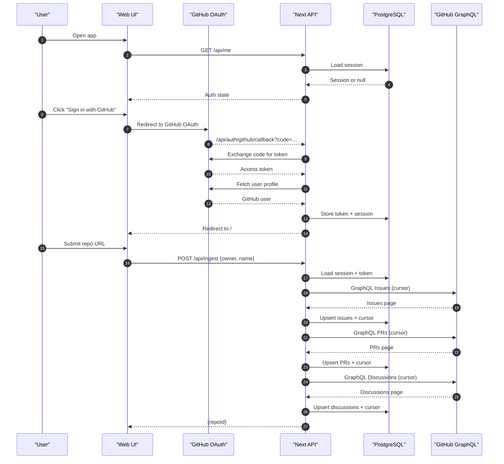
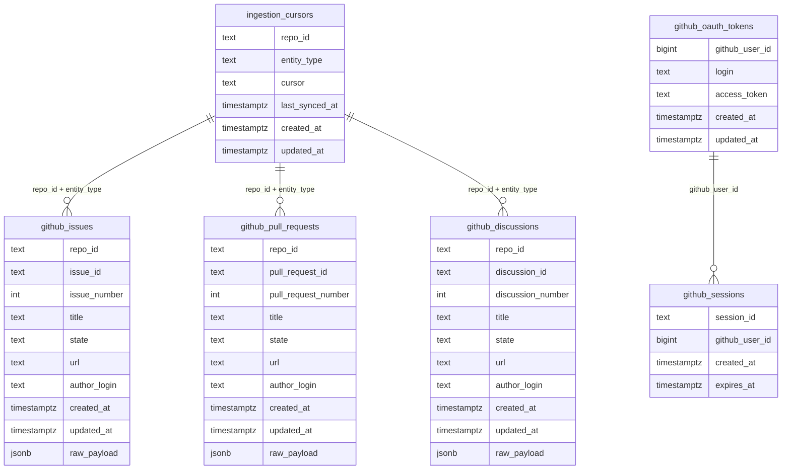

# Repository Analyzer — Technical Documentation

## Overview
This system ingests GitHub repository activity (issues, PRs, discussions), stores it in PostgreSQL, and provides a UI for users to explore data. It supports OAuth-based per-user rate limits for GitHub API calls.

---

## High-Level Design (HLD)
- Ingestion Layer: Cursor-based GraphQL ingestion with crash-safe checkpoints.
- Database: PostgreSQL storage for raw payloads and cursor state.
- Web UI: Next.js app with OAuth login and repository analytics view.
- OAuth: GitHub OAuth to use each user’s API token.

---

## Data Flow
1. User signs in with GitHub OAuth.
2. User submits a repo.
3. Ingestion runs using their token.
4. Issues/PRs/Discussions stored in DB.
5. UI queries DB and renders results.

---

## Database Schema

### ingestion_cursors
Tracks pagination progress per repo/entity.

### github_issues / github_pull_requests / github_discussions
Stores raw GraphQL payloads for all entities.

### github_oauth_tokens
Stores user tokens and GitHub login.

### github_sessions
Stores active sessions.

---

## Key Modules

### packages/github
- Reads token from env.
- Creates auth headers.

### packages/db
- Cursor repository
- Issue/PR/Discussion repositories
- Migrations

### packages/ingest
- Incremental sync engine
- Pagination and cursor logic
- Rate limit handling

### apps/web
- OAuth endpoints
- Ingestion API endpoint
- UI to display collected data

---

## Sequence Diagram (Auth + Ingestion)

---

## ER Diagram

---

## Deployment Checklist (Render + Neon)
1. Create Neon DB and copy DATABASE_URL.
2. Run migrations locally against Neon:
   DATABASE_URL="your_neon_url" node packages/db/dist/migrate.js
3. Push code to GitHub.
4. Create Render Web Service.
5. Root Directory: .
6. Build Command: pnpm install --prod=false && pnpm -r build
7. Start Command: pnpm --filter @app/web start
8. Env Vars: DATABASE_URL, GITHUB_CLIENT_ID, GITHUB_CLIENT_SECRET, APP_BASE_URL
9. Update GitHub OAuth callback URL to Render URL.
10. Redeploy and test.

---

## Notes
- All GitHub calls are made using the signed-in user’s token.
- Cursor sync ensures minimal API usage on repeat requests.
- Raw payloads are stored for future AI analysis.
